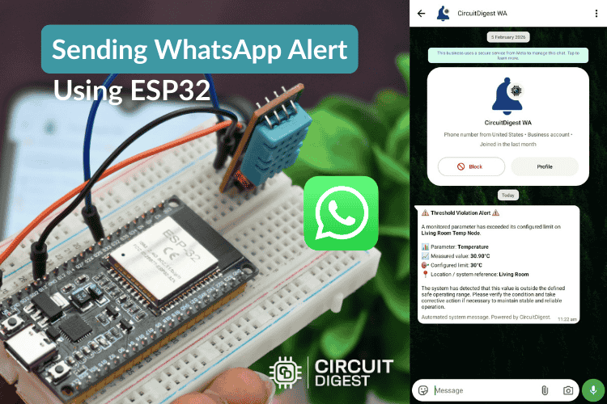
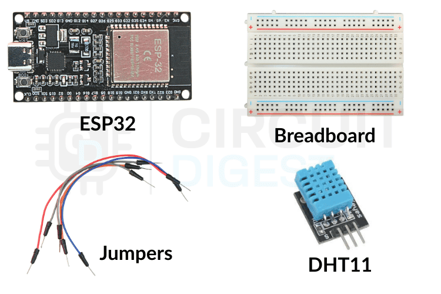
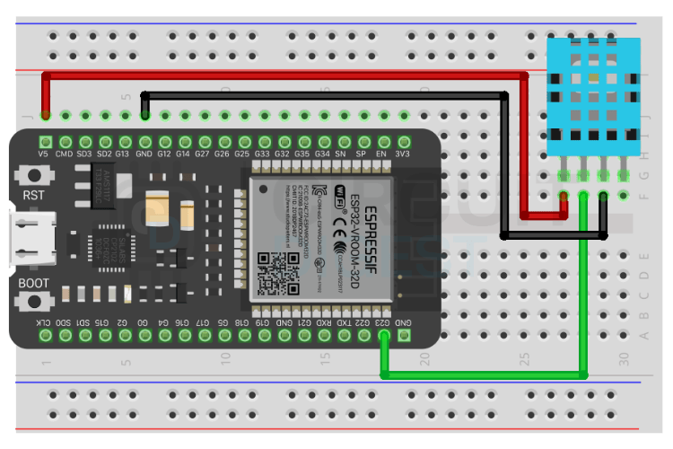
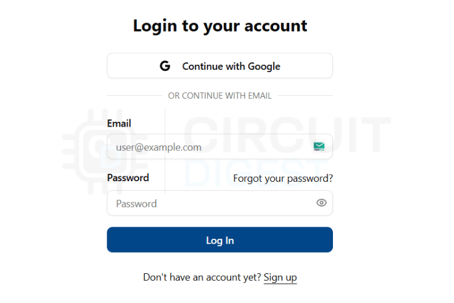
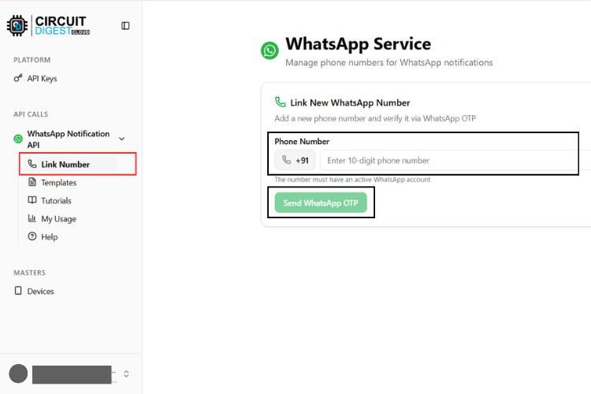
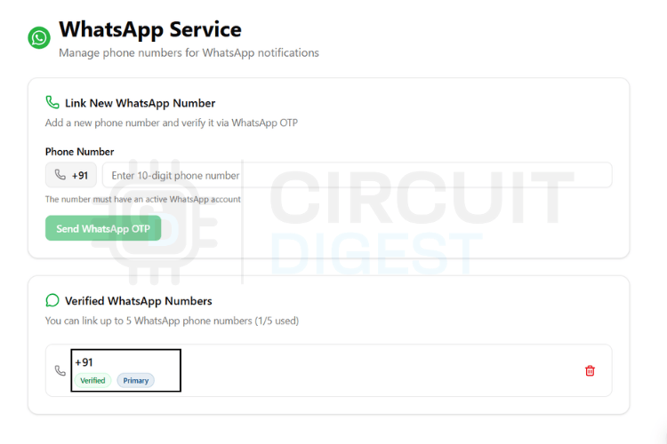
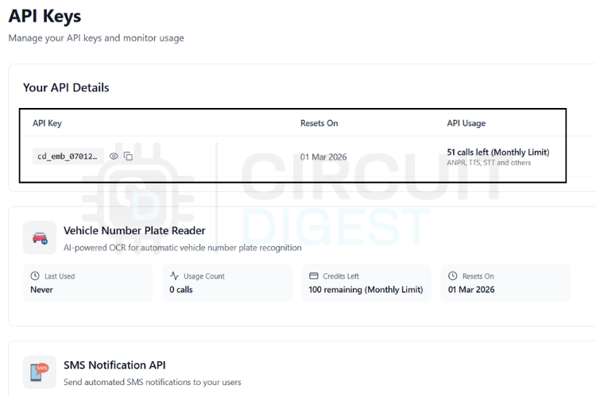
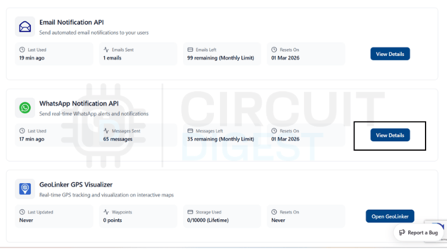

# Sending WhatsApp Messages Using ESP32

[](https://www.circuitdigest.cloud)
[](https://www.espressif.com/)
[](https://www.whatsapp.com/)

A smart IoT solution that enables ESP32 microcontrollers to send WhatsApp notifications based on sensor readings. This project demonstrates real-time temperature monitoring with automated WhatsApp alerts when thresholds are exceeded.

<p align="center">
  
</p>

## Table of Contents

- [Overview](#overview)
- [Features](#features)
- [Hardware Requirements](#hardware-requirements)
- [Software Requirements](#software-requirements)
- [Circuit Diagram](#circuit-diagram)
- [Setup Instructions](#setup-instructions)
  - [1. Hardware Assembly](#1-hardware-assembly)
  - [2. CircuitDigest Cloud Setup](#2-circuitdigest-cloud-setup)
  - [3. Software Configuration](#3-software-configuration)
- [How It Works](#how-it-works)
- [Code Explanation](#code-explanation)
- [API Configuration](#api-configuration)
- [Troubleshooting](#troubleshooting)
- [Future Enhancements](#future-enhancements)
- [License](#license)
- [Contributing](#contributing)

## Overview

This project uses an **ESP32** microcontroller with a **DHT11 temperature sensor** to monitor environmental conditions. When the temperature exceeds a predefined threshold (30°C by default), the ESP32 sends an automated WhatsApp message to your registered phone number using the **CircuitDigest Cloud WhatsApp API**.

**Use Cases:**
- Home automation temperature alerts
- Industrial equipment monitoring
- Server room environmental monitoring
- Greenhouse climate control
- Cold storage monitoring
- Any IoT application requiring instant WhatsApp notifications

## Features

- **Real-time Temperature Monitoring**: Continuous temperature reading using DHT11 sensor
- **WiFi Connectivity**: ESP32 connects to your local WiFi network
- **WhatsApp Integration**: Sends formatted WhatsApp messages via CircuitDigest Cloud API
- **Smart Throttling**: Cooldown mechanism (15 seconds) to prevent notification spam
- **Customizable Alerts**: Configurable temperature threshold and message templates
- **Secure HTTPS Communication**: Encrypted API calls to CircuitDigest Cloud
- **Easy Configuration**: Simple parameter updates for WiFi credentials and API keys

## Hardware Requirements

<p align="center">
  
</p>

| Component | Quantity | Description |
|-----------|----------|-------------|
| **ESP32 Development Board** | 1 | Main microcontroller with WiFi capability |
| **DHT11 Temperature Sensor** | 1 | Digital temperature and humidity sensor |
| **Breadboard** | 1 | For prototyping connections |
| **Jumper Wires** | 3-4 | Male-to-male or male-to-female |
| **Micro USB Cable** | 1 | For power and programming |

## Software Requirements

- **Arduino IDE** (v1.8.19 or later) or **PlatformIO**
- **ESP32 Board Support** for Arduino IDE
- **Required Libraries:**
  - `WiFi.h` (built-in with ESP32 core)
  - `WiFiClientSecure.h` (built-in with ESP32 core)
  - `DHT.h` (Adafruit DHT Sensor Library)

### Installing Libraries

1. Open Arduino IDE
2. Go to **Sketch** → **Include Library** → **Manage Libraries**
3. Search for **"DHT sensor library"** by Adafruit
4. Click **Install** (also install dependencies if prompted)

## Circuit Diagram

### Schematic Diagram
<p align="center">
  
</p>

### Breadboard Wiring
<p align="center">
  
</p>

### Pin Connections

| DHT11 Pin | ESP32 Pin | Description |
|-----------|-----------|-------------|
| VCC       | 3.3V      | Power supply |
| GND       | GND       | Ground |
| DATA      | GPIO 32   | Digital data signal |

> **Note:** The DHT11 sensor typically has 3 pins. Some modules include a built-in pull-up resistor; if yours doesn't, add a 10kΩ resistor between VCC and DATA pins.

## Setup Instructions

### 1. Hardware Assembly

1. Connect the DHT11 sensor to ESP32 as per the circuit diagram above
2. Ensure all connections are secure
3. Connect ESP32 to your computer via USB cable

### 2. CircuitDigest Cloud Setup

To use the WhatsApp API, you need to register your phone number with CircuitDigest Cloud:

#### Step 1: Create an Account
Visit [CircuitDigest Cloud](https://www.circuitdigest.cloud) and create a free account.

<p align="center">
  
</p>

#### Step 2: Link Your Phone Number
1. Navigate to the **WhatsApp API** section
2. Click on **Link Phone Number**
3. Enter your WhatsApp number (with country code, e.g., `+919876543210`)
4. Scan the QR code or enter the verification code

<p align="center">
  
</p>

<p align="center">
  
</p>

#### Step 3: Get API Key
1. Go to **API Keys** section
2. Click **Generate New Key**
3. Copy your API key (keep it secure!)

<p align="center">
  
</p>

#### Step 4: Check API Usage Limits
Monitor your API usage and limits in the dashboard.

<p align="center">
  
</p>

<p align="center">
  
</p>

### 3. Software Configuration

1. **Download the Code**
   ```bash
   git clone https://github.com/yourusername/ESP32-WhatsApp-API.git
   cd ESP32-WhatsApp-API
   ```

2. **Open the Arduino Sketch**
   - Open `Source Code/ESP32-whatsapp-api.ino` in Arduino IDE

3. **Configure WiFi Credentials**
   
   Update lines 10-11 with your WiFi network details:
   ```cpp
   const char* ssid     = "YOUR_WiFi_SSID";      // Replace with your WiFi name
   const char* password = "YOUR_WiFi_PASSWORD";  // Replace with your WiFi password
   ```

4. **Configure API Key**
   
   Update line 12 with your CircuitDigest Cloud API key:
   ```cpp
   const char* apiKey   = "YOUR_API_KEY";  // Paste your API key here
   ```

5. **Customize Phone Number**
   
   Update line 33 with your registered WhatsApp number (with country code):
   ```cpp
   "\"phone_number\":\"919876543210\",  // Replace with your number
   ```

6. **Adjust Temperature Threshold** (Optional)
   
   Modify line 7 to change the alert temperature:
   ```cpp
   #define TEMP_LIMIT 30  // Temperature in Celsius
   ```

7. **Upload to ESP32**
   - Select **Board**: ESP32 Dev Module (Tools → Board)
   - Select **Port**: Your ESP32's COM port
   - Click **Upload** button

## How It Works

```
graph LR
    A[DHT11 Sensor] -->|Reads Temperature| B[ESP32]
    B -->|Connects to| C[WiFi Network]
    B -->|Temperature > 30°C| D{Check Cooldown}
    D -->|15s Passed| E[Send HTTPS Request]
    D -->|Cooldown Active| F[Wait]
    E -->|API Call| G[CircuitDigest Cloud]
    G -->|Delivers| H[WhatsApp Message]
    H -->|Received by| I[Your Phone]
```

### Process Flow:

1. **Initialization**: ESP32 connects to WiFi and initializes DHT11 sensor
2. **Continuous Monitoring**: Temperature is read every 2 seconds
3. **Threshold Detection**: When temperature ≥ 30°C:
   - Check if 15 seconds have passed since last alert (cooldown)
   - If yes, proceed to send WhatsApp message
4. **API Request**: ESP32 sends HTTPS POST request to CircuitDigest Cloud API
5. **Message Delivery**: CircuitDigest forwards the message to WhatsApp
6. **Notification**: You receive a formatted WhatsApp alert with device details

## Code Explanation

### Key Components

#### 1. **DHT11 Sensor Configuration**
```cpp
#define DHTPIN 32        // GPIO pin connected to DHT11
#define DHTTYPE DHT11    // Sensor type
DHT dht(DHTPIN, DHTTYPE);
```

#### 2. **Cooldown Mechanism**
```cpp
#define COOLDOWN_MS 15000  // 15 seconds between alerts
unsigned long lastSentTime = 0;

// In loop()
if (now - lastSentTime > COOLDOWN_MS) {
    sendWhatsApp(temperature);
    lastSentTime = now;
}
```
This prevents flooding your WhatsApp with multiple alerts.

#### 3. **WhatsApp Message Payload**
```cpp
String payload =
  "{"
  "\"phone_number\":\"919876543210\","
  "\"template_id\":\"threshold_violation_alert\","
  "\"variables\":{"
    "\"device_name\":\"Living Room Temp Node\","
    "\"parameter\":\"Temperature\","
    "\"measured_value\":\"" + tempString + "\","
    "\"limit\":\"30°C\","
    "\"location\":\"Living Room\""
  "}"
  "}";
```

### Customization Options

| Parameter | Line | Description |
|-----------|------|-------------|
| WiFi SSID | 10 | Your WiFi network name |
| WiFi Password | 11 | Your WiFi password |
| API Key | 12 | CircuitDigest Cloud API key |
| Temperature Threshold | 7 | Alert temperature in °C |
| Cooldown Period | 8 | Time between alerts (ms) |
| Sensor Pin | 5 | GPIO pin for DHT11 |
| Phone Number | 33 | WhatsApp recipient |
| Device Name | 36 | Custom device identifier |
| Location | 40 | Physical location of sensor |

## 🔧 API Configuration

### CircuitDigest Cloud API Endpoint

- **Base URL**: `https://www.circuitdigest.cloud`
- **API Path**: `/api/v1/whatsapp/send`
- **Method**: `POST`
- **Content-Type**: `application/json`
- **Authorization**: Bearer token in header

### Request Headers
```
Authorization: YOUR_API_KEY
Content-Type: application/json
```

### Message Template Variables

The `threshold_violation_alert` template supports these variables:
- `device_name`: Custom name for your device
- `parameter`: What's being measured (e.g., "Temperature")
- `measured_value`: Current reading with unit
- `limit`: Threshold value
- `location`: Physical location

## Troubleshooting

### Issue: ESP32 Not Connecting to WiFi

**Solutions:**
- Verify SSID and password are correct
- Check WiFi network is 2.4GHz (ESP32 doesn't support 5GHz)
- Ensure WiFi signal strength is adequate
- Try resetting ESP32 and reconnecting

### Issue: "HTTPS Connection Failed"

**Solutions:**
- Check internet connectivity
- Verify `circuitdigest.cloud` is reachable
- Ensure firewall isn't blocking HTTPS traffic
- Try increasing timeout in code

### Issue: DHT11 Reading NaN (Not a Number)

**Solutions:**
- Check sensor wiring connections
- Verify power supply is stable (3.3V)
- Add a 10kΩ pull-up resistor if not present
- Replace DHT11 sensor if defective

### Issue: WhatsApp Message Not Received

**Solutions:**
- Verify API key is correct and active
- Check phone number format (include country code without '+')
- Confirm phone number is registered in CircuitDigest Cloud
- Check API usage limits haven't been exceeded
- Review Serial Monitor for API response errors

### Issue: Too Many Messages

**Solutions:**
- Increase `COOLDOWN_MS` value (default: 15000ms)
- Adjust `TEMP_LIMIT` to appropriate threshold
- Add additional conditions in trigger logic

## Future Enhancements

Potential improvements to expand this project:

-  **Multi-Sensor Support**: Add humidity, pressure, or other sensors
-  **Dynamic Threshold Configuration**: Set limits via web interface or app
-  **Data Logging**: Store readings to SD card or cloud database
-  **OLED Display**: Show current readings on local display
-  **Deep Sleep Mode**: Implement power-saving for battery operation
-  **OTA Updates**: Enable over-the-air firmware updates
-  **Multiple Recipients**: Send alerts to multiple phone numbers
-  **Custom Templates**: Define your own message templates
-  **Web Dashboard**: Real-time monitoring via web interface
-  **MQTT Integration**: Connect to home automation systems

## License

This project is open-source and available under the MIT License. Feel free to use, modify, and distribute as per the license terms.

## Support

For issues, questions, or suggestions:
- Open an issue on GitHub
- Visit [CircuitDigest Forums](https://www.circuitdigest.com)
- Check CircuitDigest Cloud [documentation](https://www.circuitdigest.cloud/)

---

*Powered by [CircuitDigest Cloud](https://www.circuitdigest.cloud) | ESP32 Platform*
